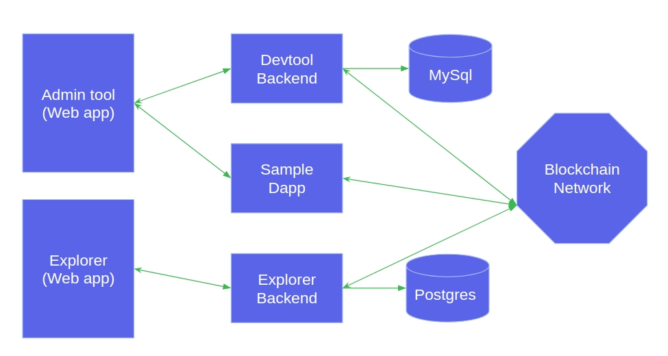

# Akachain development tool

Akachain development tool (devtool) provides the easy way for developers to create, build and test their decentralized applications on their local PC. The development tool includes the scripts to build blockchain network, blockchain explorer, decentralized application (Dapp) template, admin tool ... 

Applications/Chaincodes on this tool can run on Akachain platform and also on Hyperledger Fabric.  


## Table of Contents

  - [Devtool diagram](#devtool-diagram)
  - [Installation](#Installation)
  - [How to use](#how-to-use)
  - [Development resources](#development-resources)
  - [Known Issues](#known-issues)


## Devtool Diagram

Devtool consists of following components:
- Blockchain network: Blockchain network is based on Hyperledger Fabric. It can be customized when created using admin tool (create network). Each blockchain network contains the following components:
  - Peers (currently we support two peers)
  - CA: Certificate Authority
  - Orderer: Currently We support Solo orderer type. Raft and Kafka will be supported soon
- Dapp template: Decentralized application template to work with blockchain (It is integrated with devtool backend)
- Admin tool: To manage blockchain network (define network/delete network), Install/update/init/query chaincode.
- Blockchain explorer: To explorer everything on blockchain
- Postgres/Mysql: are databases that running on container serving devtool backend and explorer



## Installation
Currently We support running Akachain development tool on Linux (Ubuntu, Fedora, CentOS), Windows and MacOS. We strongly recommend using Ubuntu OS for development as It is well-tested and automation

### Prerequisite
- Docker version > 17.x
- Nodejs version > 8.x
- *setupEnv.sh* script will automatically check and install dependencies on Ubuntu. For other OS, Please follow the link [docker](https://docs.docker.com/install/), [nodejs](https://nodejs.org) to complete installation before using.

### Install package
- For Linux based: 
  - Setup environment or reset network ```./setupEnv.sh``` or `./setupEnv.sh reset`
  - Start again (after PC reset, program terminated ...) `./setupEnv.sh start`
- For Windows: `TO BE UPDATED ...`

The installation may take serveral minutes because It downloads many packages and docker images. After installation, please open web browser `http://localhost:4500` to get started.

## How to use

After installation, please check the *Documents* tab to learn how to use or checkout [this guide](docs/guide.md)

## Development resources

- Web: [akachain.io](https://akachain.io)
- Devtool: [dev.akachain.io](https://dev.akachain.io)
- Explorer: [dev-explorer](https://dev-explorer.akachain.io)
- Mail: [support@akchain.io](mailto:support@akachain.io)
- GitHub: [https://github.com/Akachain](https://github.com/Akachain/)
- Documentation: [akachain.readthedocs.org](https://akachain.readthedocs.io/)


## Known Issues

