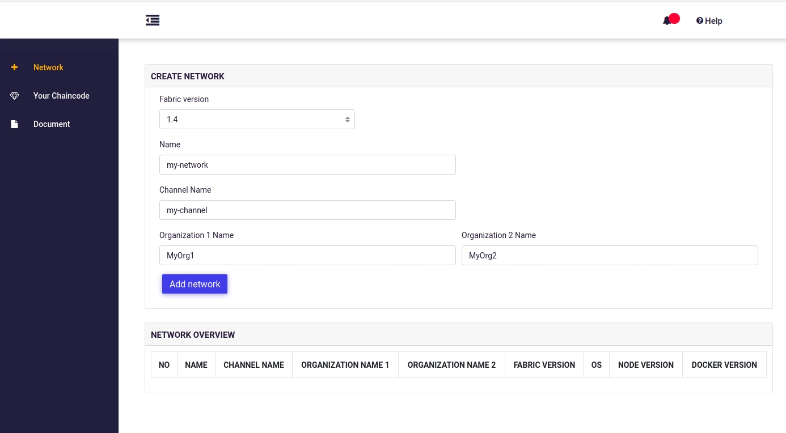

# Akachain development tool

Akachain development tool (devtool) provides the easy way for developers to create, build and test their decentralized applications on their local PC. The development tool includes the scripts to build blockchain network, blockchain explorer, decentralized application (Dapp) template, admin tool ... 

Applications/Chaincodes on this tool can run on Akachain platform and also on Hyperledger Fabric.  

## Table of Contents

  - [Devtool diagram](#devtool-diagram)
  - [Installation](#Installation)
  - [Define network](#define-network)
  - [Install Chaincode](#install-chaincode)
  - [Chaincode Development](#chaincode-development)
  - [Development resources](#development-resources)
  - [Known Issues](#known-issues)

## Devtool Diagram

Devtool consists of following components:
- Blockchain network: Blockchain network is based on Hyperledger Fabric. It can be customized when created using admin tool (create network). Each blockchain network contains the following components:
  - Peers (currently we support two peers)
  - CA: Certificate Authority
  - Orderer: Currently We support Solo orderer type. Raft and Kafka will be supported soon
- Dapp template: Decentralized application template to work with blockchain (It is integrated with devtool backend)
- Admin tool: To manage blockchain network (define network/delete network), Install/update/init/query chaincode.
- Blockchain explorer: To explorer everything on blockchain
- Postgres/Mysql: are databases that running on container serving devtool backend and explorer

## Installation
Currently We support running Akachain development tool on Linux (Ubuntu, Fedora, CentOS), Windows and MacOS. We strongly recommend using Ubuntu OS for development as It is well-tested and automation

### Prerequisite
- Docker version > 17.x
- Nodejs version > 8.x
- *setupEnv.sh* script will automatically check and install dependencies on Ubuntu. For other OS, Please follow the link [docker](https://docs.docker.com/install/), [nodejs](https://nodejs.org) to complete installation before using.

### Install package
- For Linux based: run script `./setupEnv.sh`
- For Windows: `TO BE UPDATED ...`

The installation may take serveral minutes because It downloads many packages and docker images. After installation, please open web browser `http://localhost:4500` to get started.

## Define network
Go to Network tab then fill the following information
- Fabric Version: Version of Hyperledger Fabric to be used (1.2 | 1.3 | 1.4 | 2.0)
- Network name: Name of the network
- Channel name: Name of channel that will be created.
- Orgs name: Insert name of organizations, currently we support 2 orgs.

## Install Chaincode
All chaincode files, libraries should be zipped to one *.zip file. To install chaincode, click the *Your chaincode* tab on the left pannel. Chose chaincode and then click the *Upload Chaincode* button. If chaincode is succesfully installed, It will be added to the chaicode list. It fail, an error message will be returned.

Chaincode must be initialized before used. To init chaincode, select chaincode in the chaincode list. When the chaincode detail page appear, click on *Init* tab, provide initial params and click *Init submit* button. The *Init status* in chaincode list indicates if the chaincode initializes success or not.

## Chaincode Development
Please follow the link below to learn how to develop a chaincode 

[Akachain chaincode developement](https://akc-assets.s3-ap-southeast-1.amazonaws.com/documents/AKC_Chaincode_guideline.pdf)

[Hyperledger chaincode development](https://hyperledger-fabric.readthedocs.io/en/release-1.4/tutorials.html)

## Development resources

- Web: [akachain.io](https://akachain.io)
- Devtool: [dev.akachain.io](https://dev.akachain.io)
- Explorer: [dev-explorer](https://dev-explorer.akachain.io)
- Mail: [support@akchain.io](mailto:support@akachain.io)
- GitHub: [https://github.com/Akachain](https://github.com/Akachain/)
- Documentation: [akachain.readthedocs.org](https://akachain.readthedocs.io/)

## Known Issues

