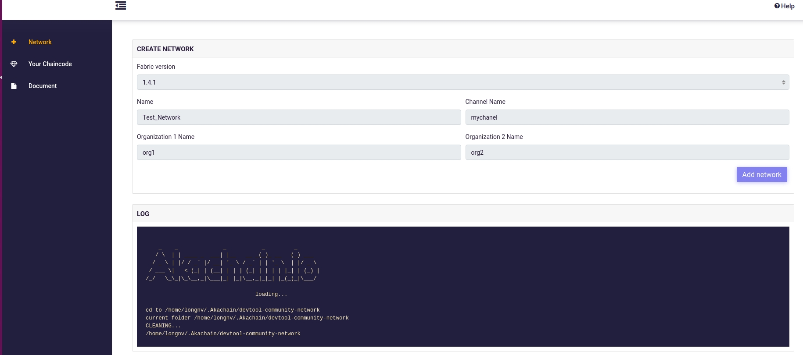

# Akachain Development Tool

This document guides how to use Akachain development tool (ADT)

Please flow this link to setup environment if ADT is not installed [github.com/akachain/devtool](https://github.com/Akachain/devtool)


## Table of Contents

  - [Create network](#create-network)
  - [Install chaincode](#install-chaincode)
  - [Working with chaincode](#Working-with-chaincode)
  - [Chaincode development](#chaincode-development)
  - [Known issues](#known-issues)
  - [Contact infomation](#contact-information)

## Create Network

Devtool consists of following components:
- Blockchain network: Blockchain network is based on Hyperledger Fabric. It can be customized when created using admin tool (create network). Each blockchain network contains the following components:
  - Peers (currently we support two peers)
  - CA: Certificate Authority
  - Orderer: Currently We support Solo orderer type. Raft and Kafka will be supported soon
- Dapp template: Decentralized application template to work with blockchain (It is integrated with devtool backend)
- Admin tool: To manage blockchain network (define network/delete network), Install/update/init/query chaincode.
- Blockchain explorer: To explorer everything on blockchain
- Postgres/Mysql: are databases that running on container serving devtool backend and explorer


To create new network, click the *Network* tab on the left pannel, fill the information and press *Add Network* button.



Network will be initiated, the process will take serveral munites to complete. The logs from process can be viewed from *LOGS* pannel.
When network creation completed, It will be added to the *NETWORK OVERVIEW* table.

Endpoint list
- Devtool frontend: http://localhost:4500
- Devtool backend : http://localhost:44080
- Devtool explorer: http://localhost:48080
- Devtool Admin   : http://localhost:44081
- To check others endpoind running inside container, please use this command `docker ps`

## Install Chaincode
All chaincode files, libraries should be zipped to one *.zip file. To install chaincode, click the *Your chaincode* tab on the left pannel. Chose chaincode file, chaincode language and then click the *Upload Chaincode* button. If chaincode is succesfully installed, It will be added to the chaicode list. It fail, an error message will be returned.


Chaincode must be initialized before used. To init chaincode, select chaincode in the chaincode list. When the chaincode detail page appear, click on *Init* tab, provide initial params and click *Init submit* button. The *Init status* in chaincode list indicates if the chaincode initializes success or not.

## Working with chaincode
### Initiate chaincode
Chaincode must be initialized before used. To init chaincode, select chaincode in the chaincode list. When the chaincode detail page appear, click on *Init* tab, provide initial params and click *Init submit* button. The *Init status* in chaincode list indicates if the chaincode initializes success or not.


### Invoke/Query/Upgrade chaincode
After chaincode is initalized, It can be invoked, queried or upgraded. Select corresponding tabs, add params and press submit button to execute operation. The image below demostrade the invoke operation (transfer balance from UserA to UserB)


Please note that devtool provides the REST API end point so that chaincode can be called from external system. When calling from other systems, some other information should be added.
Example of request body:
```json
  {
    "chaincodeId": "7171602356650428",
    "chaincodeVersion": "1",
    "language": "golang",
    "channelName": "mychanel",
    "orgName": "org1",
    "fcn": "invoke",
    "args": [
      "UserA", "UserB", "100"
    ]
}
```
*chaincodeId*, *chaincodeVersion* and other information can be extracted from devtool front-end. Please note that all APIs are using *POST method*
Example of calling chaincode from Postman


To explorer blockchain network including channel, block heigh, transaction detail ... please open blockchain explorer at http://localhost:48080


## Chaincode Development
Please follow the link below to learn how to develop a chaincode 

[Akachain chaincode developement](https://akc-assets.s3-ap-southeast-1.amazonaws.com/documents/AKC_Chaincode_guideline.pdf)

[Hyperledger chaincode development](https://hyperledger-fabric.readthedocs.io/en/release-1.4/tutorials.html)

## Known Issues
- For some reason, Mysql container is not ready when startup and devtool backend cannot connect to DB. In this cases, please check mysql container status `docker ps` to see if the status is *healthy* and then start again.

## Contact Information
- Support team: [support@akchain.io](mailto:support@akachain.io)
- Dev team: [Henry Nguyen](mailto:longnv27@fsoft.com.vn), [Eledra Nguyen](mailto:longnv35@fsoft.com.vn)
- Website: [akachain.io](https://akachain.io)
